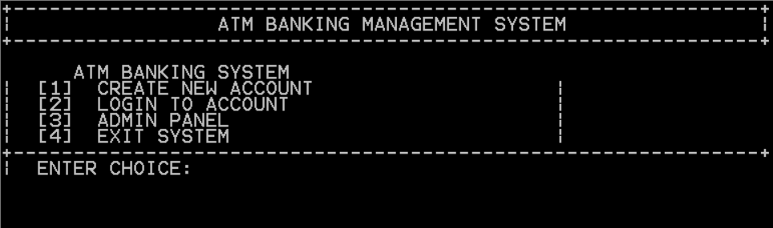
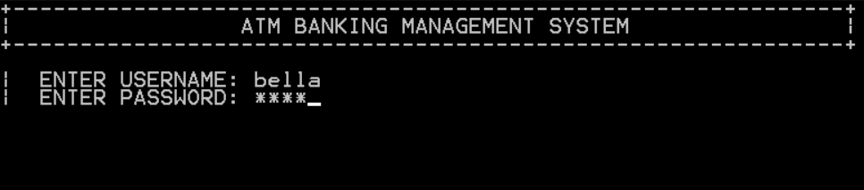
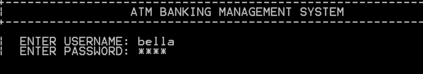
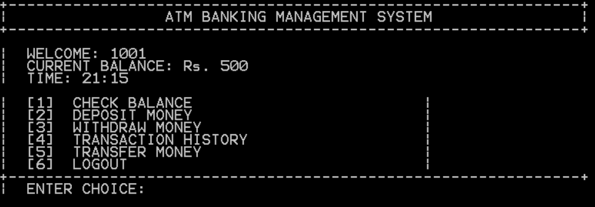
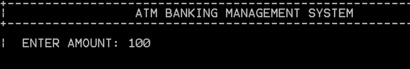
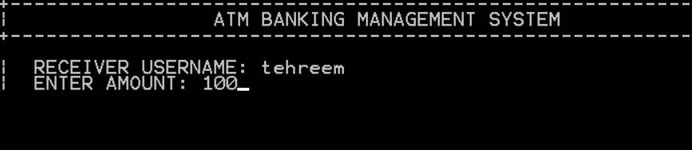
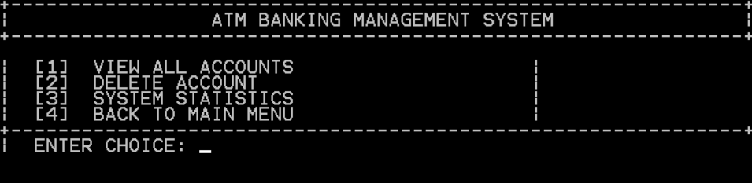

Login-Based Mini Banking System (8086 Assembly)

## Project Overview
This project is a **Login-Based Mini Banking System** developed using **8086 Assembly Language** in the EMU8086 emulator.  
It simulates basic banking operations such as user authentication, balance inquiry, deposit, and withdrawal in a menu-driven environment.

The system is designed to demonstrate core **Computer Organization and Assembly Language concepts** including registers, interrupts, loops, and conditional branching.

## Features
### Login System
- Username and password authentication
- Maximum 3 login attempts
- Access granted/denied messages

### Banking Operations
- Check Account Balance
- Deposit Money
- Withdraw Money
- Exit System

### System Handling
- Input validation
- Insufficient balance check
- Transaction success messages
- Menu-driven interface

## Technologies Used
- 8086 Assembly Language  
- EMU8086 Emulator  
- DOS Interrupts (INT 21h)  


# 🏦 ATM Banking System in 8086 Assembly

## CEN323 – Computer Organization & Assembly Language (COAL)
### Semester Project – Phase 2

---

## 📌 Project Overview

This project is an ATM-based banking management system developed in 8086 Assembly Language using emu8086. The purpose of this project is to apply COAL concepts such as registers, loops, procedures, arrays, stack operations, interrupts, and file handling in a practical application.

The system allows users to create accounts, log in securely, deposit and withdraw money, transfer funds between accounts, and view transaction history. An admin panel is also included for managing accounts and viewing system information.

---

## 👥 Team Members

| Name | Registration Number | Role |
|------|---------------------|------|
| [Tehreem Mubashar] | 01-135232-102 | Main menu, account creation, login system, admin panel, file handling |
| [Taqwa Qureshi] | 01-135232-101 | Deposit/withdraw, transfer system, transaction history |

---

## ✨ Features

| Feature | Description |
|---------|-------------|
| 🔐 Login System | Allows 3 attempts before blocking access |
| 👤 Create Account | Creates a new account with auto-generated account number |
| 💰 Deposit Money | Add money to account balance |
| 💸 Withdraw Money | Withdraw money while maintaining minimum balance |
| 🔄 Transfer Money | Transfer funds between accounts |
| 📜 Transaction History | Displays recent user transactions |
| 🛡️ Admin Panel | Admin can view or manage accounts |
| 💾 File Handling | Saves and loads account data using BANK.DAT |
| ⌨️ Password Masking | Password characters are hidden while typing |
| 🖥️ Menu Interface | ATM-style menu driven interface |

---

## 🚀 How to Run the Project

1. Install **emu8086**
2. Download or clone the project files
3. Open `BANK.ASM` in emu8086
4. Press **F5** to compile and run
5. Use the menu options displayed on the screen

Example Main Menu:

```text
+--------------------------------------------------+
|          ATM BANKING MANAGEMENT SYSTEM           |
+--------------------------------------------------+

|  [1] CREATE NEW ACCOUNT                          |
|  [2] LOGIN TO ACCOUNT                            |
|  [3] ADMIN PANEL                                 |
|  [4] EXIT SYSTEM                                 |
+--------------------------------------------------+
```

---

## 🔑 Default Admin PIN

```text
9999
```

---

## 📁 Project Files

```text
CEN323_GXX_MultiAccountBankingSystem/
│
├── BANK.ASM        # Main assembly source code
├── README.md       # Project documentation
└── .gitignore
```

---

## ⚙️ Implementation Details

- Account numbers are generated automatically starting from 1001.
- Password input is masked using keyboard interrupt INT 16h.
- User data is stored in arrays and saved into BANK.DAT.
- Data is loaded again when the program starts.
- Transaction history stores recent banking activities.
- Minimum balance of 500 PKR is enforced during withdrawal.
- Admin panel is protected using a PIN system.

---

## 📊 COAL Concepts Used

| Concept | Usage in Project |
|---------|------------------|
| Registers | AX, BX, CX, DX used in calculations and operations |
| Arithmetic Instructions | ADD, SUB, INC, DEC |
| Conditional Jumps | JE, JNE, JG, JL |
| Loops | LOOP instruction for iterations |
| Arrays | Storing usernames, balances, passwords |
| Procedures | Modular programming using CALL and RET |
| Stack Operations | PUSH and POP instructions |
| DOS Interrupts | INT 21h for input/output and file handling |
| Keyboard Interrupts | INT 16h for password masking |
| File Handling | Create, read, write, save data |
| String Handling | Username and password comparison |

---

## 🧪 Test Cases

| Test Case | Input | Expected Result | Status |
|-----------|-------|----------------|--------|
| Create Account | Username + Password | Account created successfully | ✅ |
| Correct Login | Valid credentials | User menu displayed | ✅ |
| Wrong Password | Incorrect password 3 times | Access blocked | ✅ |
| Deposit Money | Enter amount | Balance updated | ✅ |
| Withdraw Money | Valid amount | Amount withdrawn | ✅ |
| Minimum Balance Check | Withdraw below 500 | Error message shown | ✅ |
| Transfer Money | Transfer amount | Both balances updated | ✅ |
| Transaction History | View history | Recent transactions displayed | ✅ |
| Admin Login | PIN 9999 | Admin panel opened | ✅ |
| Save & Reload Data | Restart program | Data loaded successfully | ✅ |

---

## 📸 Screenshots

### 1. Main Menu


### 2. Create Account (with password masking)


### 3. Login Screen


### 4. User Menu (After Login)


### 5. Deposit Transaction



### 6. Withdraw Transaction


### 7. Transfer Money


### 8. Admin Panel

---

## ⚠️ Error Handling

The following validations and checks are implemented:

- Invalid login credentials
- Account lock after 3 failed attempts
- Insufficient balance
- Invalid withdrawal amount
- Duplicate username check
- Maximum account limit handling
- Incorrect admin PIN handling

---

## 🔧 Technical Specifications

| Item | Details |
|------|---------|
| Language | 8086 Assembly Language |
| Assembler | emu8086 |
| File Format | .COM |
| Memory Model | ORG 100h |
| File Handling | DOS INT 21h |
| Maximum Accounts | 10 |
| Minimum Balance | 500 PKR |

---

## 📅 Development Timeline

| Date | Work Completed |
|------|----------------|
| May 10 | Project structure and main menu |
| May 11 | Account creation module |
| May 12 | Login system and validation |
| May 13 | Deposit and withdrawal features |
| May 14 | Transaction history module |
| May 15 | Transfer system and admin panel |
| May 16 | File handling, debugging, and testing |

---

## 📌 Learning Outcome

Through this project, we improved our understanding of Assembly Language programming and learned how low-level operations can be used to build a complete banking application.

We also gained practical experience with:
- File handling
- Memory management
- Stack operations
- Interrupts
- Modular programming
- Debugging in emu8086

---

## 🎓 Course Information

| Item | Details |
|------|---------|
| Course | CEN323 – Computer Organization & Assembly Language |
| Instructor | Adnan Jelani |
| Semester | Spring 2026 |
| Project | Semester Project Phase 2 |

---

## 📚 References

1. Intel 8086 Microprocessor Documentation  
2. emu8086 Documentation  
3. DOS Interrupt 21h Reference  
4. Ralf Brown Interrupt List (RBIL)

---

## ✅ Project Status

Project completed and tested successfully.

---

*Submitted on: May 17, 2026*
